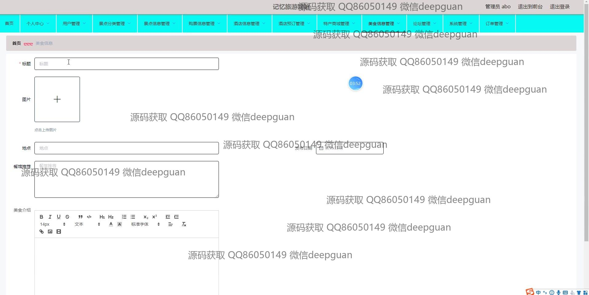
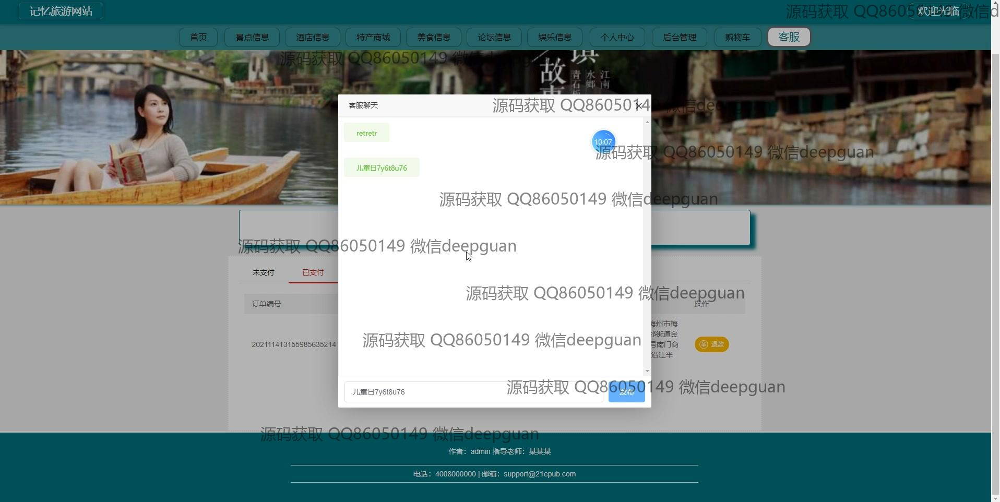

<h1 align="center">的记忆旅游-酒店特产商城美食-景点vue</h1>

## 简介
记忆旅游网站：角色分为管理员、用户；功能包括酒店管理、景点信息管理、特产商城管理、美食信息管理、用户管理、订单管理及论坛交流。    --计算机毕业设计源码；毕设源码；java毕业设计源码

## 联系方式

<h3 align="center">获取完整代码与数据库文件 + 微信：deepguan QQ: 86050149 QQ群: 783742310</h3>

<h3 align="center">可帮忙远程部署 包运行成功！提供远程部署、修改代码、设计文档指导、代码讲解等服务！</h3>

## 功能介绍（完整见运行截图）
管理员：提供后台登录、注册和退出功能，支持用户管理、景点分类管理、酒店信息管理、特产商城管理、美食信息管理、论坛管理、订单管理及客服管理等模块。可以增删改查景点、酒店和特产等信息，处理用户订单、留言与反馈，编辑导航菜单内容，进行密码修改及后台数据的维护。

用户：支持注册、登录和退出功能，通过首页导航浏览景点、酒店、美食和特产信息。可以查看商品详情、添加购物车、收藏商品或景点、在线支付订单以及查看支付状态。在个人中心可管理个人信息、查看订单和地址详情，支持在线留言及参与论坛互动。

游客：无需登录即可浏览首页，查看景点、酒店、美食、特产商城的信息详情，获取景点开放时间、门票价格和交通指南等信息。支持商品和酒店的查询与预览功能，访问论坛了解旅游推荐和评论内容。

系统：实现基于用户类型的权限管理，支持多种支付方式及账户安全管理。具备图片上传、富文本编辑、订单状态追踪、分页导航及多语言搜索功能，为用户和管理员提供全面的旅游服务体验和高效的数据管理平台。

## 运行截图

本代码来源于网络,仅供学习参考使用!

